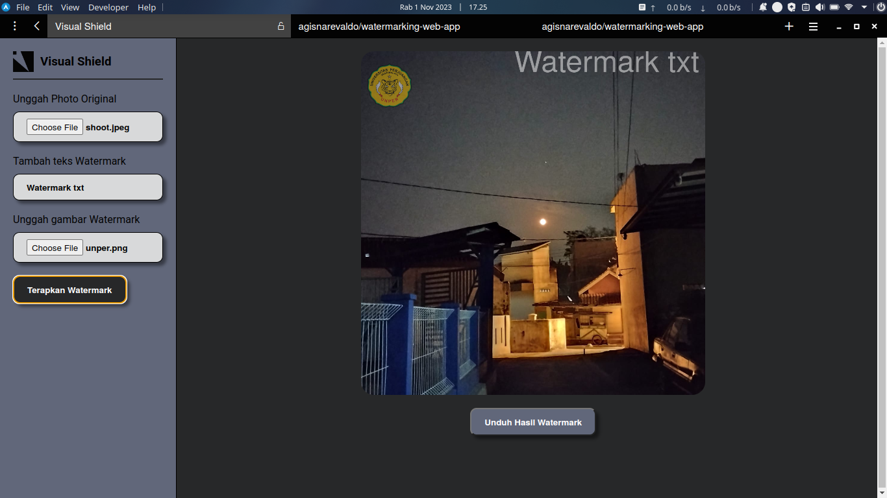
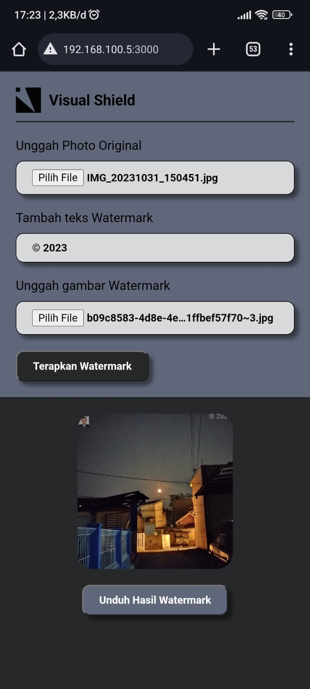

# Visual Shield (Image Watermarking Tool) 

## Tampilan

Visual Shield adalah aplikasi berbasis web sederhana yang memungkinkan Anda untuk menambahkan watermark ke gambar. Aplikasi ini mendukung dua opsi watermark: teks dan gambar. Anda dapat memilih salah satu atau keduanya sesuai kebutuhan Anda.

## Tujuan
Proyek ini dibuat untuk memenuhi tugas mata kuliah keamanan Informasi

## Penggunaan

1. **Pilih Gambar Asli**: Klik tombol "Pilih Gambar Asli" untuk mengunggah gambar yang ingin Anda watermarked.

2. **Pilih Gambar Watermark (Opsional)**: Jika Anda ingin menggunakan gambar sebagai watermark, klik tombol "Pilih Gambar Watermark" untuk mengunggah gambar watermark.

3. **Tambahkan Teks Watermark (Opsional)**: Anda dapat memasukkan teks untuk digunakan sebagai watermark dalam kolom teks yang tersedia.

4. **Klik "Tambah Watermark"**: Setelah Anda memilih gambar asli, gambar watermark, dan/atau teks watermark, klik tombol "Tambah Watermark" untuk menambahkan watermark ke gambar.

5. **Unduh Hasil Watermark**: Setelah watermark ditambahkan, Anda dapat mengunduh gambar hasil dengan mengklik tombol "Unduh Hasil Watermark".

## Kontribusi

Jika Anda ingin berkontribusi pada proyek ini, silakan buka masalah (issue) atau kirimkan permintaan tarik (pull request). Kami selalu terbuka untuk perbaikan dan peningkatan.

---
